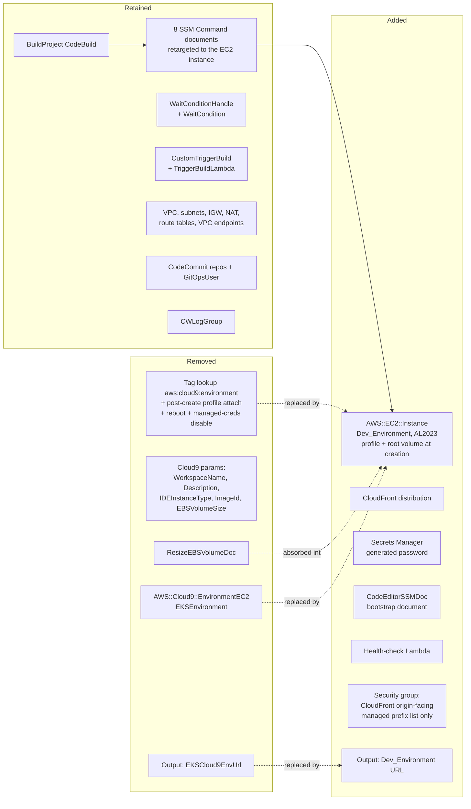
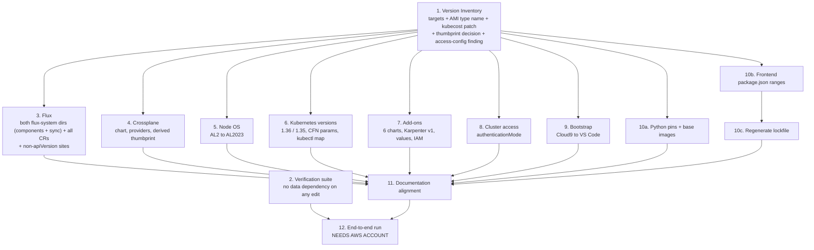

# Design Document

## Overview

This design upgrades every version-pinned component of the `eks-multi-cluster-gitops` sample to a current supported release, migrates the manifests and configuration that those upgrades break, replaces the AWS Cloud9 development environment with VS Code served in the browser from an Amazon EC2 instance, and realigns the documentation with what the repository deploys.

The work is a coordinated version cutover rather than an architectural change. The hub/spoke topology, the repository layout, the set of Git repositories, and the composed AWS resource set are all preserved. What changes is: the version string in each pin, the API group versions that Flux and Karpenter resources declare, the node AMI family, the CloudFormation resources that host the setup, and the prose that describes all of it.

Three forces make this a migration rather than a bump:

| Force | Consequence |
|---|---|
| Flux v2.7/v2.8 removed the beta API versions this repository uses | Every `Kustomization`, `GitRepository`, `HelmRepository`, and `HelmRelease` must declare a GA version in the finished tree. The target controllers serve exactly one version per CRD, so there is no configuration in which both the old and new group-versions are valid. |
| Amazon EKS stopped publishing Amazon Linux 2 AMIs after Kubernetes 1.32 | Both target versions (1.36, 1.35) are above that boundary, so `AL2_x86_64`, `AL2_x86_64_GPU`, and Karpenter's `AL2` family cannot appear in the finished tree. |
| AWS Cloud9 is closed to new customers | `AWS::Cloud9::EnvironmentEC2` fails stack creation in a fresh account, so the automated setup path is unusable today independent of any version pin. |

### Target versions

| Axis | Value |
|---|---|
| Target_Kubernetes_Version (management cluster) | `1.36` |
| Workload_Kubernetes_Version (workload clusters) | `1.35` |
| Flux distribution | `v2.9.5` |
| Crossplane core chart | `1.20.12` |
| Crossplane AWS provider | `crossplane-contrib/provider-aws:v0.59.0` |
| Crossplane Kubernetes provider | `crossplane-contrib/provider-kubernetes:v1.3.1` |

Workload clusters stay one minor version behind the management cluster deliberately, so the documented cluster upgrade scenario has a real version gap to exercise (Requirement 2 criterion 2, Requirement 9 criterion 8).

### Non-goals

Four migrations are deliberately excluded and are recorded in the documentation as deferred future work:

| Deferred migration | Reason |
|---|---|
| Crossplane v2 | v2 removes composite resource connection details. The workload cluster Flux bootstrap reads `cluster-ca`, `apiserver-endpoint`, and the kubeconfig from a composite connection secret, so v2 would break cluster onboarding. The upgrade stays on the v1.20 line, which is still receiving patches. Reference: https://docs.crossplane.io/master/guides/upgrade-to-crossplane-v2/ |
| `ControllerConfig` → `DeploymentRuntimeConfig` | `ControllerConfig` (`pkg.crossplane.io/v1alpha1`) is deprecated upstream but still served by the v1.20 line. Replacing it is independent of the version bump. |
| Native-mode `Composition` → Pipeline mode with patch-and-transform | Rewriting ~730 lines of inline patches into a function pipeline is a behavioural rewrite, not a version change. Native mode remains served by v1.20. |
| `aws-auth` ConfigMap → EKS access entries | `aws-auth` is deprecated but still honoured while the cluster authentication mode includes `CONFIG_MAP`. Reference: https://docs.aws.amazon.com/eks/latest/userguide/auth-configmap.html |

AWS CodeCommit is **not** migrated. It was closed to new customers in the same July 2024 announcement as Cloud9, but AWS reversed that decision and returned CodeCommit to general availability on 24 November 2025 (https://aws.amazon.com/blogs/devops/aws-codecommit-returns-to-general-availability). Both the CodeCommit and GitHub repository backends are carried forward unchanged.

## Architecture

The upgrade touches nine areas of the repository. Each area is upgraded as a unit. The areas are largely independent of one another; what ordering exists between them is data dependency rather than preference, and is set out in Execution Order and Dependencies.

| Area | Repository surface | Upgrade character |
|---|---|---|
| A. Kubernetes / EKS versions | `initial-setup/auto/cfn.yaml`, `initial-setup/config/mgmt-cluster-eksctl.yaml`, `clusters-config/template/def/eks-cluster.yaml` | Version values plus parameter constraint rewrite |
| B. Flux | both generated files in each `clusters/*/flux-system` directory — `gotk-components.yaml` regenerated, `gotk-sync.yaml` edited in place — every Flux CR under `repos/`, and the non-`apiVersion` group-version sites | Controller bump plus repository-wide API cutover |
| C. Crossplane platform | `tools/crossplane/**`, `tools-config/crossplane-*/**` | Chart and package bumps, thumbprint derivation |
| D. Cluster add-ons | `tools/{aws-ebs-csi,aws-load-balancer-controller,external-secrets,karpenter,kubecost,sealed-secrets}`, matching `tools-config/*` | Chart bumps with values-schema and CRD API migrations |
| E. Node OS | `tools-config/crossplane-eks-composition/composition.yaml`, `tools-config/karpenter-config/node-pool.yaml` | AL2 → AL2023 |
| F. Cluster access | `mgmt-cluster-eksctl.yaml`, composition EKS `Cluster` resource | Explicit `authenticationMode` |
| G. Bootstrap environment | `initial-setup/auto/cfn.yaml`, `initial-setup/config/`, `initial-setup/img/` | Cloud9 removal, VS Code environment addition, SSM retarget |
| H. Sample applications | `repos/apps/**`, `repos/apps-manifests/**` | Base image and dependency pins, immutable tags |
| I. Documentation | `README.md`, `scenarios.md`, `initial-setup/README.md`, `initial-setup/doc/**`, `repos/gitops-system/README.md`, `bin/README.md`, `clean-up/README.md` | Version and step realignment |

Two cross-cutting invariants hold throughout:

- **Identical twins.** `clusters/mgmt/flux-system/gotk-components.yaml` and `clusters/template/flux-system/gotk-components.yaml` must declare the same distribution version, the same controller image tags, and the same CRD API versions (Requirement 3 criterion 8). Any edit to one is applied to the other.
- **Templates keep their placeholders.** The `bin/*.sh` scripts emit no Flux or Crossplane manifests: they copy the `template` directories and `sed` placeholder names into the copies, or drive `yq` with field paths. Their one manifest-emitting heredoc, `bin/add-app-cluster-overlay.sh` line 15, writes a `kustomize.config.k8s.io/v1beta1` `Kustomization`, which no upgrade in this spec touches. Requirement 8 criterion 12 therefore constrains the templates rather than the scripts: a template directory whose manifests change must keep intact the placeholders the scripts substitute — `cluster-name` throughout `clusters/template/`, `clusters-config/template/` and `workloads/template/`, and `REPO_PREFIX/gitops-system` in `clusters/template/flux-system/gotk-sync.yaml`. Area B's edits to that file preserve both, and the area B and C group-version cutovers need no corresponding change inside any script.

## Data Models

### Version Inventory artifact

**Path:** `.kiro/specs/component-version-upgrade/version-inventory.yaml`

YAML is chosen over a markdown table because the Verification_Process consumes this file directly for the duplicated-reference consistency check (Requirement 10 criterion 13) and for the documentation drift check (Requirement 9 criterion 17). A rendered markdown view is not maintained separately, to avoid a second place for versions to drift.

**Schema.** The file is a mapping with a single `entries` key holding a sequence. Each entry is one Version_Reference — one occurrence in one file.

| Field | Required | Meaning |
|---|---|---|
| `component` | yes | Pinned_Component name, e.g. `flux-source-controller` |
| `category` | yes | One of `k8s-version`, `helm-chart`, `container-image`, `crossplane-package`, `k8s-api-version`, `cli-tool`, `python-dist`, `npm-package`, `aws-resource` |
| `file` | yes | Repository-relative path |
| `locator` | yes | YAML field path, environment variable name, or line number containing the version string |
| `current` | yes | Version string exactly as it appears in the file |
| `target` | yes | Target_Version |
| `status` | yes | One of the six status flags below |
| `successor` | conditional | Required when `status` is `superseded` or `removed`; names the replacing artifact or component |
| `source_url` | conditional | URL of the source of record; required unless `status` is `no-source` |
| `consulted` | conditional | ISO-8601 date the source was consulted; required whenever `source_url` is present |
| `duplicate_group` | conditional | Shared identifier present on every entry of a Duplicated_Reference |
| `notes` | no | Migration mechanics, e.g. a field rename forced by the target |

**Status flags.** Exactly one applies per entry.

| Flag | Meaning | Requirement |
|---|---|---|
| `upgrade` | Ordinary bump; `current` resolves upstream and a newer release exists | 1.3 |
| `unresolvable` | `current` is absent from the upstream registry; `current` is retained verbatim and `target` records the highest GA non-pre-release version | 1.4 |
| `superseded` | The artifact is replaced by a differently named upstream artifact; `successor` and `source_url` name it | 1.5 |
| `no-source` | No maintainer page or registry states a version; `target` equals `current` and `source_url` is omitted | 1.8 |
| `mutable` | `current` is a floating tag; `target` is a string identifying a single immutable artifact | 1.9 |
| `removed` | The component is removed rather than upgraded; `successor` names its replacement | 1.10 |

**Duplicated references.** A Duplicated_Reference produces one entry per file path, all sharing a `duplicate_group` value (Requirement 1 criterion 6). Every entry in a group carries the identical `target` string (Requirement 1 criterion 7). The Verification_Process asserts both: group membership implies target equality, and reports each divergent occurrence with its path and stated version.

**Worked example.**

```yaml
entries:
  - component: flux-source-controller
    category: container-image
    file: repos/gitops-system/clusters/mgmt/flux-system/gotk-components.yaml
    locator: spec.template.spec.containers[0].image
    current: v1.1.2
    target: v1.9.5
    status: upgrade
    source_url: https://github.com/fluxcd/flux2/discussions/5572
    consulted: 2026-11-20
    duplicate_group: flux-source-controller-image

  - component: flux-source-controller
    category: container-image
    file: repos/gitops-system/clusters/template/flux-system/gotk-components.yaml
    locator: spec.template.spec.containers[0].image
    current: v1.1.2
    target: v1.9.5
    status: upgrade
    source_url: https://github.com/fluxcd/flux2/discussions/5572
    consulted: 2026-11-20
    duplicate_group: flux-source-controller-image

  - component: requests
    category: python-dist
    file: repos/apps/product-catalog-api/v1/requirements.txt
    locator: requests
    current: v2.33.0
    target: <highest GA release on PyPI>
    status: unresolvable
    source_url: https://pypi.org/project/requests/
    consulted: 2026-11-20
    notes: >-
      Stray `v` prefix; PyPI publishes no such version. Fails installation today.
      Target is recorded as digits and separators only.

  - component: product-catalog-fe image tag
    category: container-image
    file: repos/apps-manifests/product-catalog-fe-manifests/kubernetes/overlays/prod/deployment.yaml
    locator: spec.template.spec.containers[0].image
    current: latest
    target: <immutable release tag>
    status: mutable
    source_url: https://kubernetes.io/docs/concepts/containers/images/
    consulted: 2026-11-20
    duplicate_group: product-catalog-fe-image-tag

  - component: Cloud9ImageId
    category: aws-resource
    file: initial-setup/auto/cfn.yaml
    locator: Parameters.Cloud9ImageId
    current: amazonlinux-2-x86_64
    target: n/a
    status: removed
    successor: Dev_Environment AMI parameter (VS Code on Amazon EC2)
    source_url: https://docs.aws.amazon.com/cli/latest/reference/cloud9/
    consulted: 2026-11-20

  - component: openid-connect-provider thumbprint
    category: aws-resource
    file: repos/gitops-system/tools-config/crossplane-eks-composition/composition.yaml
    locator: spec.resources[cluster-oidc-idp].base.spec.forProvider.thumbprintList[0]
    current: 9e99a48a9960b14926bb7f3b02e22da2b0ab7280
    status: upgrade
    target: 9e99a48a9960b14926bb7f3b02e22da2b0ab7280
    notes: documented well-known AWS OIDC root-CA constant (Starfield G2); target==current; supersedes DERIVATION 2 (patch), which produced an AWS-invalid value in the live run
```

## Components and Interfaces

### A. Kubernetes and Amazon EKS versions

| Location | Before | After |
|---|---|---|
| `mgmt-cluster-eksctl.yaml` `metadata.version` | `1.29` | `1.36` |
| `mgmt-cluster-eksctl.yaml` `apiVersion` | `eksctl.io/v1alpha5` | the config API version accepted by eksctl `v0.230.0` |
| `cfn.yaml` `KubernetesVersion` default | `1.29` | `1.36` |
| `cfn.yaml` `KubernetesVersion` AllowedValues | `1.29`, `1.28`, `1.27` | the Kubernetes minor versions Amazon EKS lists on **standard** support, including `1.36` and `1.35`, excluding every extended-support and unlisted version |
| `cfn.yaml` kubectl download map | `1.29.0`, `1.28.5`, `1.27.9` | exactly one released patch URL per allowed value, each of the same minor version as the key that selects it |
| `eks-cluster.yaml` `eks-k8s-version` | `1.28` | `1.35` |
| `eks-cluster.yaml` `mng-k8s-version` | `1.28` | `1.35` |

**Mechanics.**

- The `AllowedValues` list and the kubectl `Mappings` block are edited as a pair. Requirement 2 criterion 6 requires a 1:1 correspondence, so the CloudFormation template is invalid if the two lists diverge; the verification suite asserts key-set equality between them.
- `AllowedValues` gives Requirement 2 criterion 11 for free: CloudFormation rejects an out-of-set value at stack-create time, before any cluster is created.
- The management cluster uses the parameter default (`1.36`); the workload cluster version lives in `eks-cluster.yaml` and is not parameterised. They are intentionally different, so no cross-file equality check applies — instead the verification suite asserts `workload == target - 1` and that both appear in the EKS standard support set.

### B. Flux upgrade and API cutover

| Component | Before | After |
|---|---|---|
| Distribution | `v2.1.2` | `v2.9.5` |
| source-controller image † | `v1.1.2` | `v1.9.5` |
| kustomize-controller image † | `v1.1.1` | `v1.9.5` |
| helm-controller image † | `v0.36.2` | `v1.6.4` |
| notification-controller image † | `v1.1.0` | `v1.9.4` |
| Flux CLI in `cfn.yaml` (`FLUX_VERSION`) | `0.35.0` | a `2.9` release |
| Flux CLI in `initial-setup/README.md` | unpinned (`curl -s https://fluxcd.io/install.sh \| sudo bash`, line 145) | the same `2.9` release, pinned |
| `Kustomization` | `kustomize.toolkit.fluxcd.io/v1beta2` | `kustomize.toolkit.fluxcd.io/v1` |
| `GitRepository` | `source.toolkit.fluxcd.io/v1beta2` | `source.toolkit.fluxcd.io/v1` |
| `HelmRepository` | `source.toolkit.fluxcd.io/v1beta2` | `source.toolkit.fluxcd.io/v1` |
| `HelmRelease` | `helm.toolkit.fluxcd.io/v2beta1` | `helm.toolkit.fluxcd.io/v2` |

† The four controller image rows are **derived from the regenerated `gotk-components.yaml`**, not targets to be edited into it. See "`gotk-components.yaml` is regenerated, not edited" below: if the CLI pinned at the target distribution version emits different controller versions, the emitted values win and these rows plus the matching Version Inventory entries are corrected to match — the file is never edited to match the inventory. Otherwise documentation-drift check 11 fails against a file that is correct by construction.

**`gotk-components.yaml` is regenerated, not edited.**

`clusters/mgmt/flux-system/gotk-components.yaml` and `clusters/template/flux-system/gotk-components.yaml` are 8029-line generated files (379,935 bytes each, currently byte-identical). Each embeds six CustomResourceDefinitions with their full OpenAPI schemas (`buckets`, `gitrepositories`, `helmcharts`, `helmrepositories`, `kustomizations`, and the notification/receiver set), three NetworkPolicies, a PriorityClass, the aggregate RBAC set, and four controller Deployments — source-controller, kustomize-controller, helm-controller, notification-controller, all carrying `app.kubernetes.io/version: v2.1.2` with default container args. No image-automation or image-reflector controller is deployed, although the aggregate ClusterRoleBinding lists them as subjects; that is stock Flux output and is preserved by regeneration.

Substituting version strings in place is not a sound method for this file, for a correctness reason rather than a convenience one. The embedded CRDs carry complete schemas, and a `v1beta2` schema cannot be string-edited into the `v1` schema set the target ships; RBAC rules, container args, and resource defaults also changed between `v2.1.2` and `v2.9.5`. A version-substituted file would be a manifest no Flux release ever shipped. That compounds with verification check 2, whose CRD cache is extracted from this same file: a hand-edited file would validate the repository's custom resources against schemas that do not correspond to the controllers actually running, producing false confidence instead of a failure.

The procedure is therefore generate-and-diff:

1. **Generate offline with `flux install --export`.** It requires no cluster and no credentials. `flux bootstrap` MUST NOT be used — it writes to a cluster and to a git repository.
2. **First prove the checked-in file is unmodified stock output.** Generate with the CLI pinned at the *current* version (`v2.1.2`) and diff that against the checked-in file. An empty diff establishes that the file carries no local customization and that regeneration is safe. A non-empty diff *is* the local customization, and must be re-applied on top of the new output. Skipping this step is exactly how a local modification gets silently dropped.
3. **Generate once at the target version and copy the single output to both twins.** This makes Correctness Property 3 — the twins stating identical values — satisfied by construction, rather than by carefully performing the same edit twice.

**`gotk-sync.yaml` is the second generated file in each directory.** Each `flux-system` directory also contains `gotk-sync.yaml` (538 bytes for mgmt, 546 for template) and a `kustomization.yaml` listing both generated files as resources. `gotk-sync.yaml` is generated ("This manifest was generated by flux. DO NOT EDIT.") and carries two removed group-versions: a `GitRepository` on `source.toolkit.fluxcd.io/v1beta2` and a `Kustomization` on `kustomize.toolkit.fluxcd.io/v1beta2`. It cannot be handled by dropping regenerated output over it, because it also holds the `REPO_PREFIX/gitops-system` placeholder that the `bin` scripts substitute into `spec.url`, and a per-cluster `spec.path` (`./clusters/mgmt` for the mgmt twin). Either edit the two `apiVersion` lines in place, or regenerate and re-insert the placeholder and the path. Unlike the components twins, the two `gotk-sync.yaml` files legitimately differ, so no twin-equality property applies to them.

**Mechanics and ordering.**

1. **The cutover is a final-state consistency requirement, not an edit-order one.** In v2.9.5 each of these CRDs serves exactly one version, marked as the storage version, so the finished tree must pair the new components with new custom resources everywhere — a tree mixing the two is invalid regardless of the order in which its files were written. Because this is a source-code change that nothing reconciles while it is in progress, editing `gotk-components.yaml` before or after the consuming resources is equally safe; the invariant is stated as Correctness Property 1 and enforced by verification check 2, not by sequencing. The Flux work is nevertheless kept as a single task for ergonomics and reviewability: it is one logical change across the edit surfaces enumerated below, and splitting it invites landing half of it and leaving the final tree inconsistent. The separate requirement that an operator apply the component and resource changes together in one reconciliation is live-cluster guidance and lives in the migration notes (area I) and the end-to-end run.
2. **Three edit surfaces, not one.** Flux group-versions appear in (i) the two generated files in each `flux-system` directory — `gotk-components.yaml`, replaced wholesale by regenerated output, and `gotk-sync.yaml`, edited in place or regenerated with its placeholder and path preserved; (ii) the custom resources throughout `repos/`; and (iii) the non-`apiVersion` occurrences covered by mechanic 3. The Flux CLI only produces the `flux-system` directory, so every surface other than (i) remains a manual edit. A grep for the removed group-versions across the whole repository is the completeness test. Note that `bin/*.sh` is **not** an edit surface here: the scripts copy template directories and `sed` placeholder names, or drive `yq` with field paths, and contain zero Flux group-versions. The only manifest-emitting heredoc is `bin/add-app-cluster-overlay.sh` line 15, and it emits `kustomize.config.k8s.io/v1beta1`. A whole-repository grep is still the right completeness test; it simply will not find Flux group-versions in the shell scripts (inventory FINDING 5).
3. **Non-`apiVersion` occurrences.** Requirement 3 criterion 10 covers fields that name a Flux group-version outside a resource's own `apiVersion`. In this repository the primary such site is the kustomize `spec.patches[].target` `group` + `version` key pair — 22 occurrences repo-wide, of which the Flux ones are in `clusters/mgmt/crossplane.yaml` and `clusters/template/crossplane.yaml`. The second is `spec.healthChecks[].apiVersion`, which names `helm.toolkit.fluxcd.io/v2beta1` in several `Kustomization`s. The third is inline strategic-merge patch bodies, which carry YAML inside a string and so are invisible to structural queries. `spec.dependsOn` and both `sourceRef` forms are **not** such sites in this repository: `dependsOn` carries only `- name:`, and `sourceRef`/`spec.chart.spec.sourceRef` carry only `kind`/`name`/`namespace` (inventory FINDING 7). All three real sites are searched for separately because a group-version-aware grep on `apiVersion:` alone misses the patch-target pair and the string-embedded bodies.
4. **Field migrations.** Where the target controller renamed or removed a field that a resource sets, the replacement field is set such that the applied object set and the reconciliation dependency order are unchanged (Requirement 3 criterion 5). Behaviour-preserving means: same objects applied, same `dependsOn` graph, same prune and health-check semantics.
5. **CLI/controller alignment.** Requirement 3 criteria 6 and 7 constrain only major.minor, so the CLI pin in `cfn.yaml` and in `initial-setup/README.md` must both be a `2.9` release; they are recorded as a Duplicated_Reference so the verification suite catches one being bumped without the other. The alignment extends to generation: the CLI version used to produce the `flux-system` manifests should be the same version those two files pin, so that following the documented install reproduces the checked-in manifests. Today only `cfn.yaml` pins anything — `initial-setup/README.md` line 145 installs Flux unpinned via `curl -s https://fluxcd.io/install.sh | sudo bash`, so the `0.35.0` pair the table's two CLI rows previously described does not exist (inventory FINDING 1/20). Pinning the README is part of this area's change, not an incidental doc fix.

Reference for the removal timeline: https://github.com/fluxcd/flux2/discussions/5572

### C. Crossplane platform

| Component | Before | After |
|---|---|---|
| Crossplane chart | `1.15.0` | `1.20.12` (exact; no range or wildcard) |
| AWS provider | `crossplane-contrib/provider-aws:v0.47.1` | `crossplane-contrib/provider-aws:v0.59.0` |
| Kubernetes provider | `crossplane-contrib/provider-kubernetes:v0.13.0` | `crossplane-contrib/provider-kubernetes:v1.3.1` |
| `ControllerConfig` | `pkg.crossplane.io/v1alpha1` | unchanged (still served by v1.20; deprecation noted in docs) |
| AWS `ProviderConfig` | `aws.crossplane.io/v1beta1` | unchanged |
| Managed resource groups | `ec2.aws.crossplane.io/v1beta1`, `eks.aws.crossplane.io/v1beta1`, `eks.aws.crossplane.io/v1alpha1`, `iam.aws.crossplane.io/v1beta1`, `dynamodb.aws.crossplane.io/v1alpha1`, `kubernetes.crossplane.io/v1alpha1` | unchanged, subject to per-group confirmation that `v0.59.0` still serves each version |
| `Composition` mode | native resource mode | unchanged |
| OIDC thumbprint | literal `9e99a48a…` | documented well-known AWS root-CA constant `9e99a48a…` (unchanged; patch derivation reverted after live-run failure) |
| `kubectl` helper image | `bitnami/kubectl:1.22.11` | an immutable tag within one minor of `1.36` |

**The monolith stays.** An earlier reading of this upgrade treated `crossplane-contrib/provider-aws` as superseded by a per-service provider family, on the basis of a 2023 project-status discussion. That reading is stale: the monolith published `v0.59.0` on 12 August 2026. Staying on it means the `*.aws.crossplane.io` API groups, the `aws.crossplane.io/v1beta1` `ProviderConfig`, and every managed resource manifest keep their current group-versions — no per-service provider is introduced, and the blast radius of area C is confined to four version strings plus the thumbprint.

**API-group confirmation is still required.** Retaining the group names does not guarantee that `v0.59.0` still serves every *version* the repository declares — the two `v1alpha1` groups in use (`eks.aws.crossplane.io/v1alpha1` for `NodeGroup`, `kubernetes.crossplane.io/v1alpha1` for `Object`/`ProviderConfig`, `dynamodb.aws.crossplane.io/v1alpha1` for the sample app table) are the ones at risk. Each is confirmed against the CRDs shipped in the target package and recorded in the inventory. Requirement 4 criterion 5 permits zero managed resources on an unserved group-version.

**Connection details chain — must not regress.** This chain is the reason Crossplane v2 is out of scope, and it is verified structurally after the upgrade:

```
compositeresourcedefinition.yaml : connectionSecretKeys [cluster-ca, apiserver-endpoint, kubeconfig]
composition.yaml                 : eks-cluster.writeConnectionSecretToRef.name  <- patched from metadata.uid
composition.yaml                 : connectionDetails  cluster-ca <- clusterCA
                                                      apiserver-endpoint <- endpoint
                                                      value <- kubeconfig
eks-cluster.yaml                 : writeConnectionSecretToRef -> flux-system/cluster-name-eks-connection
                                   -> Flux bootstrap of the workload cluster reads this secret
```

Exactly three connection details are published, under the current names (`cluster-ca`, `apiserver-endpoint`, `value`), and the composed resource set is preserved exactly: VPC, internet gateway, four subnets, two Elastic IPs, two NAT gateways, three route tables, EKS `Cluster`, managed `NodeGroup`, `OpenIDConnectProvider`, and the cluster-info and remote-bootstrap `Object`/`ProviderConfig` resources. No composed resource is added or removed.

**OIDC thumbprint is a documented well-known constant.** `spec.resources[cluster-oidc-idp].base.spec.forProvider.thumbprintList[0]` is set to `9e99a48a9960b14926bb7f3b02e22da2b0ab7280` — the well-known AWS OIDC root-CA thumbprint (Starfield Services Root CA G2), which is the repo's original value. This resolution supersedes the earlier plan to derive the thumbprint at provisioning time. Two derivation forms were considered and both are unavailable:

1. Omitting `thumbprintList` is rejected by the CRD: `provider-aws v0.59.0` lists `thumbprintList` in `required` with `minItems: 1`, so the field cannot be omitted or left empty.
2. Patching it from the composite's own status (the cluster's OIDC issuer field), mirroring the `spec.forProvider.url` patch, produces an AWS-invalid value. A live end-to-end run against a real AWS account showed that the issuer URL (~60 chars) fails IAM validation with "Member must have length equal to 40": IAM requires each member to be exactly a 40-char hex SHA-1 thumbprint, and Crossplane patches cannot compute a SHA-1.

Because neither omission nor patch derivation is viable, a documented constant is used. For EKS OIDC endpoints AWS validates against its own trusted-CA store and does not rely on the supplied value; it only enforces the 40-char format. The Starfield root CA is long-lived, so a stale-fingerprint failure is not a practical risk. Requirement 4 criterion 17 is relaxed accordingly: it permits this single documented well-known constant (recorded with an explanatory comment in the composition) while still forbidding per-cluster or hand-copied thumbprints that could silently go stale. The invalid thumbprint patch is removed; the `status.eks_cluster_oidc_issuer_url -> spec.forProvider.url` patch is kept.

### D. Cluster add-ons

| Chart | Before | After | Migration risk |
|---|---|---|---|
| aws-load-balancer-controller | `1.4.6` | `3.5.0` | **High** — chart and appVersion are now aligned at 3.x, so this spans a controller major bump (v2 → v3). Expect values-schema renames and new IAM actions. **Live-run correction:** v3 hard-fails at startup fetching the VPC id from IMDS on this solution's workload node group (IMDS hop limit 1); set chart values `region: ${AWS_REGION}` and `vpcId: ${VPC_ID}` per-cluster via `postBuild` substitution from the `cluster-info` ConfigMap — see the ALB controller v3 IMDS/VPC note below. |
| external-secrets | `0.4.4` | `2.10.0` | **High** — two major lines crossed; substantial values-schema change expected. |
| aws-ebs-csi-driver | `2.30.0` | `2.66.0` | Low — same major line. |
| sealed-secrets | `2.7.1` | `2.20.0` | Low — same major line; namespace label must follow the controller image version. |
| karpenter | `0.36.1` | `1.14.1` | **High** — v1 API graduation with documented breaking changes. |
| kubecost cost-analyzer | `2.2.2` | `2.8.4` | Low — same `2.x` major line. There is no `8.15.x` line of this chart (that string is the bundled prometheus subchart constraint in the 1.x charts). The target was first recorded as `2.9.6`, but the live run showed the whole `2.9.x` line is a "prepare to upgrade to 3.0" **transition release** that hard-requires federation/transition config (cluster_id in two places plus a global federated store) and is not a valid standalone fresh-install target. Re-pinned to `2.8.4`, the highest **stable non-transition** cost-analyzer in the OCI registry `oci://public.ecr.aws/kubecost` (2.8.x tops out at `2.8.4`). **Values-schema note:** `global.clusterId`/`global.clusterName` are still set to `${CLUSTER_NAME}` per-cluster via `postBuild` (a mandatory value vs 2.2.2, valid and harmless in 2.8.x). The 2.9-only second cluster_id place (`prometheus.server.global.external_labels.cluster_id`) is dropped — see the superseded note below. The `forecasting.fullImageName` override is re-pinned to `public.ecr.aws/kubecost/kubecost-modeling:v0.1.31`, the modeling tag chart 2.8.4 declares. |

**Values-schema migration procedure** (applies to every chart, and is the substance of the two high-risk migrations). For each add-on: render the target chart's default values, diff the key set against the `spec.values` block in the current `HelmRelease`, and classify each of our keys as unchanged, renamed (Requirement 5 criterion 3), or removed (Requirement 5 criterion 4). A removed key is re-expressed through whatever key the target accepts for the same behaviour, not dropped. Keys we set that the target chart no longer recognises are the failure mode the verification suite catches by validating each `HelmRelease` values block against the target chart's values schema where one is published. Where a chart publishes *no* `values.schema.json` (kubecost is such a chart), the offline diff cannot see newly *mandatory* keys the chart enforces only at install time — the kubecost `global.clusterId` requirement surfaced only in the live end-to-end run and is now set per-cluster via `postBuild` (see the kubecost row above). The same live run also exposed that the `2.9.x` line is a 3.0-transition release, prompting the re-pin to the stable `2.8.4`.

**ALB controller v3 IMDS/VPC requirement** (chart `3.5.0`, live-run correction, inventory FINDING 25). Controller v3 fetches the VPC id from EC2 IMDS at startup and hard-fails when it cannot reach it: `failed to get VPC ID ... ec2imds GetMetadata ... context deadline exceeded`. On this solution the workload managed `NodeGroup` runs with the EC2 IMDS hop limit of 1, so controller pods (one hop from the host) never reach IMDS. Controller v2 (chart `1.4.6`) tolerated the missing lookup; v3 does not. The fix does not touch the node or its IMDS configuration — instead the controller is given its region and VPC id explicitly through the chart values `region` and `vpcId`, sourced per-cluster from the workload `cluster-info` ConfigMap. This needs three coordinated edits:

- `tools/aws-load-balancer-controller/aws-lb-controller-release.yaml` sets `spec.values.region: ${AWS_REGION}` and `spec.values.vpcId: ${VPC_ID}` (the existing `serviceAccount` values are kept).
- `clusters/template/aws-load-balancer-controller.yaml` gains a `spec.postBuild.substituteFrom` referencing the `cluster-info` ConfigMap (`kind: ConfigMap`, `name: cluster-info`, `optional: false`), matching karpenter-config.yaml / kubecost.yaml; the existing `patches` (clusterName) and `dependsOn` are kept.
- `tools-config/crossplane-eks-composition/composition.yaml` gains a new `VPC_ID` data key on BOTH workload `cluster-info` ConfigMaps (`configmap-cluster-info-workload-cluster` and `remote-configmap-cluster-info-workload-cluster`), populated from the composed VPC's `status.atProvider.vpcId` — surfaced onto the composite as `status.vpc_id` by a `ToCompositeFieldPath` patch on the `vpc` resource (mirroring the existing `status.atProvider.ownerId -> status.account_id` patch), then mapped into the ConfigMap data by the shared `cluster-info-mappings` patchSet like the other keys. `AWS_REGION` already exists on those ConfigMaps.

**kubecost 2.9 two-place cluster_id** (chart `2.9.6`, live-run correction, inventory FINDING 24b — **SUPERSEDED** by the re-pin to `2.8.4`, kept as history). This applied only to the 2.9.x transition line. Setting `global.clusterId` alone was not enough there: the chart's `kubecost.clusterId` helper (`cost-analyzer/templates/_helpers.tpl`, referenced from `cost-analyzer-deployment-template.yaml:1062`) required `.Values.global.clusterId` to *equal* `.Values.prometheus.server.global.external_labels.cluster_id`, otherwise aborting the render with "In kubecost 2.9, cluster_id is set in two places". That two-place requirement is precisely what identifies 2.9.x as a 3.0-transition release. Rather than satisfy it, the fleet re-pinned to the stable `2.8.4` line, which has no such requirement, so `prometheus.server.global.external_labels.cluster_id` is **removed** from `tools/kubecost/kubecost-release.yaml`; only `global.clusterId` and `global.clusterName` remain (resolved per-cluster by the `postBuild` substitution wired on the kubecost `Kustomization`).

**Default StorageClass for PVC-backed add-ons** (live-run correction, inventory FINDING 26). The EKS 1.35 workload cluster ships no default StorageClass — the only StorageClass present is a non-default `gp2` naming the removed in-tree provisioner `kubernetes.io/aws-ebs`. Add-ons whose PVCs leave `storageClassName` empty (kubecost `cost-analyzer` and its bundled `prometheus-server`) then bind to nothing and their PVCs stay Pending. Fix: add a default `gp3` StorageClass backed by the already-deployed EBS CSI driver as `tools/aws-ebs-csi/storageclass-gp3.yaml` (`provisioner: ebs.csi.aws.amazonaws.com`, `type: gp3`, `volumeBindingMode: WaitForFirstConsumer`, `allowVolumeExpansion: true`, `reclaimPolicy: Delete`, annotated `storageclass.kubernetes.io/is-default-class: "true"`), and list it in that directory's `kustomization.yaml`. It rides the existing tools sync with no new dependency.

**IAM policy updates.** Requirement 5 criterion 5 requires adding actions that the maintainers publish for the target version and that are missing from our policy documents. This applies to `tools-config/aws-load-balancer-controller-iam`, `aws-ebs-csi-iam`, `external-secrets-iam`, `karpenter-iam`, and `crossplane-iam`. The comparison direction is additive only — actions present in ours but absent upstream are left alone, because the sample may grant more than the minimum.

**Crossplane DynamoDB read actions** (live-run correction, inventory FINDING 27). A workload `dynamodb.aws.crossplane.io` `Table` reached ACTIVE in AWS but its managed resource stayed Synced=False with `AccessDeniedException: not authorized to perform: dynamodb:DescribeContinuousBackups`. provider-aws v0.59.0's Table observe / isUpToDate path reads back more than the create/update set grants. The embedded IAM policy in `tools-config/crossplane-iam/crossplane-iam.yaml` (statement Sid Stmt1658117635374) is extended with the three read actions the v0.59.0 Table observer makes — `dynamodb:DescribeContinuousBackups`, `dynamodb:DescribeTimeToLive`, and `dynamodb:ListTagsOfResource` — added together so successive observe calls do not fail one after another. This is an install-time behaviour the offline scan could not see; task 8.5 had left crossplane-iam unchanged.

**Karpenter v1 field migration** (chart `1.14.1`), in `tools-config/karpenter-config/node-pool.yaml`:

| Field | Before | After |
|---|---|---|
| `NodePool` `apiVersion` | `karpenter.sh/v1beta1` | `karpenter.sh/v1` |
| `EC2NodeClass` `apiVersion` | `karpenter.k8s.aws/v1beta1` | `karpenter.k8s.aws/v1` |
| `NodePool` `spec.template.spec.nodeClassRef.apiVersion` | `karpenter.k8s.aws/v1beta1` | the v1 form the target CRD requires (`group`/`kind`/`name`) |
| `disruption.consolidationPolicy` | `WhenUnderutilized` | `WhenEmptyOrUnderutilized` |
| `EC2NodeClass` `spec.amiFamily` | `AL2` | `AL2023` |
| `EC2NodeClass` `spec.amiSelectorTerms` | absent | **now required** — `- alias: al2023@latest` |

The `nodeClassRef` change is easy to miss: it is an API group-version stated *inside* a resource, not the resource's own `apiVersion`, and Requirement 5 criterion 6 names it explicitly. `amiSelectorTerms` moving from optional to required (Requirement 5 criterion 8) means a v1beta1 manifest that is otherwise field-identical will be rejected by the v1 CRD schema. Reference: https://karpenter.sh/v1.0/upgrading/v1-migration/

**Sealed Secrets version coupling.** Three places must state the same controller version: the chart pin (`2.20.0`), the namespace label at `clusters-config/template/secrets/namespace.yaml` (currently `v0.26.3`, Requirement 5 criterion 11 requires the full major.minor.patch of the controller image the target chart deploys), and the `kubeseal` install command in `initial-setup/README.md` (currently `v0.19.4`, Requirement 5 criterion 12 constrains major.minor). The controller image version deployed by chart `2.20.0` is resolved during the Version_Scan and recorded once, then propagated; the three are a Duplicated_Reference group so drift is caught.

**CRD artifacts.** Where a target chart ships CRDs in a separate artifact (Requirement 5 criterion 10), that artifact is pinned to the same version as the application chart. This is checked per add-on during the scan rather than assumed.

### E. Node OS: AL2 → AL2023

Amazon EKS ceased publishing Amazon Linux 2 AMIs on 26 November 2025; Kubernetes `1.32` was the last version for which they were published. Both `1.36` and `1.35` are above that boundary, so AL2 is unusable for the management cluster *and* the workload clusters — this is not a preference. Reference: https://docs.aws.amazon.com/eks/latest/userguide/al2023.html

**This is a final-state invariant, not an edit-ordering constraint.** The finished tree must never pair a Kubernetes version above `1.32` with an AL2 AMI type or AMI family; whether the AMI values or the version values are edited first is immaterial, because no intermediate tree is reconciled against a cluster. Correctness Property 11 states the invariant and verification check 15 confirms publication. The corresponding *live-cluster* constraint — that an operator must have AL2023 in place before moving a running cluster's version above `1.32`, since a node group cannot be created from an AMI that is no longer published — is operator guidance recorded in the migration notes (area I) and in the end-to-end run.

| Location | Before | After |
|---|---|---|
| `composition.yaml` node group `amiType`, `workload-type: non-gpu` branch of the `map` transform | `AL2_x86_64` | `AL2023_x86_64_STANDARD` |
| `composition.yaml` node group `amiType`, `workload-type: gpu` branch | `AL2_x86_64_GPU` | the AL2023 accelerated AMI type Amazon EKS publishes for both `1.36` and `1.35` |
| `node-pool.yaml` `EC2NodeClass.spec.amiFamily` | `AL2` | `AL2023` |
| `node-pool.yaml` `EC2NodeClass.spec.amiSelectorTerms` | absent | `- alias: al2023@latest` |

The composition change is a value edit inside the existing `map` transform on `spec.parameters.workload-type` — the transform structure and both branches are preserved, so `workload-type: gpu` keeps working. The AL2023 accelerated AMI type name is confirmed against the EKS AMI documentation during the scan and recorded in the inventory rather than guessed here.

AL2023 changes node bootstrap from the AL2 shell-script user data to `nodeadm` configuration. The managed node group path absorbs this transparently. For Karpenter, `amiFamily: AL2023` selects the matching bootstrap mode, which is why `amiFamily` and `amiSelectorTerms` must be changed together.

### F. Cluster access configuration

`aws-auth` is retained. Both the console IAM entity and the Karpenter node role continue to be granted access through the ConfigMap, `repos/gitops-system/clusters/template/aws-auth.yaml` stays, and the documented bootstrap steps that add those entries stay.

Retaining it requires the cluster authentication mode to include `CONFIG_MAP`, and that must be stated **at creation** — it cannot be added later:

| Cluster | Where `authenticationMode` is set |
|---|---|
| Management_Cluster | `initial-setup/config/mgmt-cluster-eksctl.yaml`, in the eksctl access-config block, as `API_AND_CONFIG_MAP` |
| Workload_Cluster | `composition.yaml`, the `eks-cluster` resource's `spec.forProvider` access-config field, as `API_AND_CONFIG_MAP`, confirmed against the `Cluster` CRD in `provider-aws v0.59.0` |

`API_AND_CONFIG_MAP` is chosen over `CONFIG_MAP` because it keeps `aws-auth` honoured while leaving access entries available for the deferred migration. Two irreversibility constraints are documented (Requirement 6 criterion 10): once `API` is enabled it cannot be disabled, and a cluster created without `CONFIG_MAP` can never gain it. If `provider-aws v0.59.0` does not expose the access-config field on its `Cluster` resource, the fallback is to verify that its default creation mode already includes `CONFIG_MAP` and record that finding in the inventory — the requirement is that the mode be stated in the request, so an unsettable field is a blocking finding, not something to work around silently.

### G. Bootstrap environment: Cloud9 → VS Code

The Cloud9 instance is not merely an editor — it is the **SSM Run Command execution host** for the automated setup path. Nine SSM Command documents run against it, driven by a CodeBuild project that finds the instance via the `aws:cloud9:environment` tag. So the orchestration is retargeted, not removed.



**Resource-level change list.**

| Disposition | Items |
|---|---|
| Removed | `AWS::Cloud9::EnvironmentEC2` (`EKSEnvironment`); parameters `Cloud9WorkspaceName`, `Cloud9WorkspaceDescription`, `Cloud9IDEInstanceType`, `Cloud9ImageId`, `Cloud9EBSVolumeSize`; `ResizeEBSVolumeDoc`; output `EKSCloud9EnvUrl`; every `cloud9:*` IAM action; every `CLOUD9_*` environment variable; the `aws:cloud9:environment` tag lookup, the post-create instance-profile association, the reboot that picked it up, and the managed-credentials disable step |
| Added | Dev_Environment `AWS::EC2::Instance` (AL2023, SSM-managed); CloudFront distribution; Secrets Manager generated password; `CodeEditorSSMDoc` bootstrap document; health-check Lambda; security group scoped to the CloudFront origin-facing managed prefix list; Dev_Environment URL output; Dev_Environment instance-type and volume-size parameters |
| Retargeted | `InstallK8sClientToolsDoc`, `CloneWorkshopRepo`, `CreateEKSClusterDoc`, `CreateRootSealedSecretsEncryptionKeysDoc`, `SetupCodeCommitSSHAccessDoc`, `CloneCodeCommitReposDoc`, `CreateIAMRoleForCrossplaneDoc`, `ConfigureWorkshopEnvironmentDoc`, `BootstrapGitAndManagementClusterDoc` — all eight retained documents plus the bootstrap document now name the Dev_Environment instance as the Run Command target |
| Renamed | `EKSEnvironmentInstanceProfile` and `EKSEnvironmentRole` are retained in function but reattached: the profile is stated in the instance declaration rather than associated afterwards, and the role drops its `cloud9:*` statements |
| Unchanged | `BuildProject`, `WaitForStackCreationHandle`/`WaitCondition`, `CustomTriggerBuild`/`TriggerBuildLambda` and its role, `CWLogGroup`, the template's own VPC/subnets/IGW/NAT/route tables/S3+DynamoDB endpoints, all four CodeCommit repositories, `GitOpsUser`, `CodeBuildRole`, and parameters `ClusterName`, `ConsoleRoleName`, `KubernetesVersion`, `WorkerNodeInstanceType`, `WorkshopRepoCloneUrl`, `SsmRunCommandCloudWatchLogGroupName` |

**Orchestration continuity.** CodeBuild still drives the sequence and still signals `WaitCondition` on completion; only its *instance discovery* changes. Instead of the Cloud9 tag lookup followed by a profile attach, CodeBuild reads the Dev_Environment instance ID from a stack resource reference — the instance already carries its profile from creation, so the attach-and-reboot steps disappear entirely (Requirement 2 criterion 18). Likewise the root volume is sized in the instance declaration, so `ResizeEBSVolumeDoc` is deleted rather than retargeted (criterion 19).

**Readiness gate.** The health-check Lambda polls the Dev_Environment URL. If the environment is not reachable within 20 minutes of the instance entering `running`, the stack reports a failure naming the Dev_Environment as the failing resource and the setup documents do not run (Requirement 2 criterion 24). This gate sits between instance creation and the CodeBuild trigger.

**Access path.** Inbound access to the instance is restricted to the AWS-managed CloudFront origin-facing prefix list for the stack's Region, with no other inbound rule (criterion 22). The access credential is generated into Secrets Manager, and no literal credential appears in any template (criterion 23). The stack output carries the URL (criterion 21).

**Assets deleted.** `initial-setup/config/cloud9-role-permission-policy-template.json`; `initial-setup/img/c9-modify-role.png`; `initial-setup/img/c9instancerole.png`; `initial-setup/img/cloud9-role.png`.

**Live-run defects (inventory FINDING 28, 29, 30 & 31).** Deploying the automated path end-to-end surfaced five defects that the offline retarget missed, all now fixed. (A) The retained setup documents run as `OS_USER=ec2-user` and `cd ~/environment`, relying on a workspace directory Cloud9 used to auto-create; the VS Code Dev_Environment's `CodeEditorSSMDoc` creates only `${DevEnvironmentHomeFolder}` (`/workshop`) for the `participant` user, so `/home/ec2-user/environment` never existed and `git clone` failed with a permission error that cascaded to the dependent documents. Fix: each of the five documents using `~/environment` (`CloneWorkshopRepo`, `CreateRootSealedSecretsEncryptionKeysDoc`, `SetupCodeCommitSSHAccessDoc`, `CloneCodeCommitReposDoc`, `CreateIAMRoleForCrossplaneDoc`) now creates and owns the directory (`mkdir -p /home/$OS_USER/environment && chown $OS_USER: /home/$OS_USER/environment`) immediately after its OS_USER `case`/`esac` block, before the first `cd` — a self-contained, order-independent step. This is the same Cloud9-workspace assumption FINDING 8 flags for the OS guard, not carried into the new instance by task 10.3/10.4. (B) The `BuildProject` BuildSpec captured setup status with command substitution — `EXIT_CODE=$(process_command_status ...)` — but `process_command_status` echoes progress to stdout and reports failure via `return`, so `$(...)` captured the progress text, not the return code; a failed setup left `CODEBUILD_BUILD_SUCCEEDING` at 1 and `post_build` signalled SUCCESS, so the stack reported CREATE_COMPLETE over a failed setup. Fix (both call sites): call `process_command_status` directly, capture `EXIT_CODE=$?`, and `exit $EXIT_CODE` on non-zero so the build terminates non-zero → CodeBuild fails → `post_build` signals FAILURE → the stack rolls back. (C) The setup documents derive the Region from the EC2 instance identity document with a token-less IMDSv1 request (`curl -s http://169.254.169.254/latest/dynamic/instance-identity/document`); the AL2023 Dev_Environment base image requires IMDSv2, so that request returned empty and `AWS_REGION` resolved to `""` — eksctl reported "AWS Region must be set" and `aws secretsmanager create-secret` hit `secretsmanager..amazonaws.com` (exit 255). The empty value also propagated into `~/.bash_profile` and thus into the later login-shell documents. Fix: the two places that derive the Region (`InstallK8sClientToolsDoc` step and `CreateEKSClusterDoc` step) now fetch an IMDSv2 token (`PUT /latest/api/token`) and pass it as the `X-aws-ec2-metadata-token` header; downstream login-shell documents inherit the corrected value from `~/.bash_profile`. Like (A), this is a Cloud9 → VS Code migration consequence — Cloud9 set the Region automatically. (D) The `installK8sClientTools` step installed the `kubeseal` CLI by parsing the redirect `location:` header from `bitnami-labs/sealed-secrets/releases/latest` to extract the version tag; the sealed-secrets repo was renamed to the `bitnami` org, so the old-org URL now returns a repo-rename redirect ending in `/latest`, the version parsed as the literal `latest`, and the resulting `kubeseal-latest-linux-amd64.tar.gz` 404’d — `tar -xz` failed and `kubeseal` never installed (the step still passed because the commands are not under `set -e`). Fix: drop the latest-parsing block and pin `KUBESEAL_VERSION=0.40.0` from the current `bitnami` org, matching the manual README and the spec’s pinning philosophy; stale `bitnami-labs` references in `NOTICE.md` and the READMEs were corrected too. (E) Even once `~/environment` existed, the cloned repo was invisible in the editor: the setup docs run as `ec2-user` (cloning into `/home/ec2-user/environment`, mode 0700) while the browser VS Code editor is served as `participant` and opened `/workshop` — a directory `participant` could neither reach nor find the repo in, and `/workshop` is itself a migration artifact the lab guides (all rooted at `~/environment`) never use. Fix: restore the coherent single-user model as `participant` — `CodeEditorSSMDoc` writes `/etc/workshop.env` (via `!Sub`, honouring the `DevEnvironmentUser`/`DevEnvironmentHomeFolder` params); each setup doc sources it right after OS detection and sets `OS_USER` to the participant user (so the existing `$OS_USER` paths and `~/environment` heredocs all follow with no further edits); and `DevEnvironmentHomeFolder` defaults to `/home/participant/environment`, so the folder the editor opens, the clone target, and `~/environment` are one and the same — keeping every lab guide correct.

### H. Sample applications

| Item | Before | After |
|---|---|---|
| API base image (v1 and v2) | `python:3.9-slim` | an explicit `python:3.X-slim` whose CPython security-support end date is after the commit date |
| Frontend base image | `node:14` | an explicit even-numbered Node.js major in Active or Maintenance LTS |
| `requests` (v1, v2) | `requests==v2.33.0` | an exact PyPI version, digits and separators only |
| `Flask` | `3.1.3` (v1) / `3.0.3` (v2) | one identical version in both files |
| `werkzeug` | `3.1.6` (v1) / `3.0.6` (v2) | one identical version in both files |
| `express` | `^4.22.3` | a range whose lower bound is published on npm |
| `body-parser` | `^1.20.8` | a range whose lower bound is published on npm |
| Other npm deps | `axios ^1.18.0`, `ejs ^3.1.10`, `prom-client ^14.0.1`, `nodemon ^2.0.18` | ranges resolvable by the bundled npm client |
| Frontend lockfile | present, may be stale | regenerated so every resolved version satisfies its range and every declared dependency is present |
| Frontend prod/staging image tag | `:latest` | an immutable tag in both overlays |

**Mechanics.**

- `requests==v2.33.0`, `express ^4.22.3`, and `body-parser ^1.20.8` name versions that were never published. These fail installation *today*, so the container builds are currently broken independent of any upgrade — fixing them is not optional cleanup.
- The v1/v2 drift on Flask and werkzeug is resolved by choosing one version per distribution. Requirement 7 criterion 6 is a character-by-character comparison of shared entries, so the two files' shared lines must be byte-identical.
- The lockfile is regenerated after the ranges settle, because a lockfile-validating install (`npm ci`) fails on an out-of-sync lockfile. The install command's options must be accepted by the npm version bundled in the chosen Node image (criterion 8) — an option removed in a newer npm is a build failure, not a warning.
- Both frontend overlays (prod and staging) currently use `:latest`; both are changed. Requirement 7 criterion 9 covers every prod and staging deployment manifest, so the API manifests are checked too.
- The health path is `/ping`, used by the smoke check in the verification suite.

### I. Documentation alignment

| Documentation change | Detail |
|---|---|
| Version restatement | Every version the docs mention becomes its inventory `target`, with zero occurrences of the pre-upgrade version. Affects `initial-setup/README.md` most heavily: kubectl `1.24.7` → a `1.36` patch, `yq v4.24.5` → `v4.53.6`, `kubeseal v0.19.4` → the controller minor from chart `2.20.0`, Flux CLI `0.35.0` → a `2.9` release. |
| Cloud9 → Dev_Environment | The Cloud9 workspace preparation section is replaced by steps for opening the VS Code environment, including how the reader obtains the URL (stack output) and the credential (Secrets Manager). The Ubuntu 18.04 description is replaced by the Dev_Environment OS name and version. |
| Cloud9 IAM steps removed | The steps and screenshots for creating and attaching the Cloud9 instance role are deleted, along with every reference to `cloud9-role-permission-policy-template.json`. Remaining steps in those procedures are renumbered consecutively. |
| Manual path portability | The docs state that the manual setup path may be run either from the Dev_Environment or from the reader's own terminal, and list the tools that terminal needs. |
| Clean-up | `clean-up/README.md` gains a Dev_Environment deletion step and loses the Cloud9 deletion step. |
| Broken path fix | `initial-setup/README.md` instructs the reader to apply `gitops-system/tools-config/eks-console/{role,role-binding}.yaml`, and no `eks-console/` directory exists. Requirement 9 criterion 16 resolves this either by pointing at the equivalent resource the repository does provide, or by omitting the step where there is no equivalent. Console access is already granted through `aws-auth`, so omission is the likely resolution — the decision is recorded in the documentation change log. |
| Cluster upgrade scenario | `scenarios.md` states the upgrade as `1.35` → `1.36` and states no other Kubernetes version number in that scenario. |

**Four mandated rationale notes.** Each is a short documented statement with a resolvable upstream link:

| Note | Content | Requirement |
|---|---|---|
| Version gap by intent | Workload clusters run one minor below the management cluster so the upgrade scenario has a gap to exercise | 9.8 |
| Crossplane v2 out of scope | Names composite resource connection details, native patch-and-transform composition, and `ControllerConfig` as the capabilities v2 removes; links the v2 upgrade guide | 4.20 |
| `aws-auth` deprecated but retained | Links the EKS `aws-auth` guidance; records access entries as deferred; states both irreversibility constraints | 6.10 |
| Cloud9 closure | States that the development environment changed because AWS closed Cloud9 to new customers; links a page stating that unavailability | 9.18 |

Plus a per-component migration log (Requirement 9 criterion 6): for each Pinned_Component whose upgrade required a manifest or configuration change, the component name, the change made, and a resolvable upstream migration URL. The Flux, Karpenter, AL2023, and Crossplane entries all carry the reference URLs cited in this design.

**Live-upgrade ordering guidance.** The migration log entries for AL2023 and Flux additionally carry ordering instructions addressed to an operator rolling this upgrade onto *running* infrastructure — a reader who already has clusters provisioned from an earlier revision of this sample. These constraints do not apply to editing the repository, where intermediate states are inert, and they are stated as such:

| Component | Operator instruction |
|---|---|
| Node OS (AL2 → AL2023) | Move node groups and `EC2NodeClass` resources to AL2023 **before** raising a running cluster's Kubernetes version above `1.32`. Above that boundary Amazon EKS publishes no AL2 AMI, so a node group that still declares `AL2_x86_64` cannot be created or replaced. Expect node replacement. |
| Flux | Apply the `gotk-components.yaml` change and the consuming custom resource changes **together, in one reconciliation**. Applying the new components alone leaves existing beta resources unserved; applying the new resources alone fails admission against the old CRDs. Reference: https://github.com/fluxcd/flux2/discussions/5572 |
| Karpenter | Follow the upstream v1 migration order rather than applying the v1 manifests directly, and schedule the node replacement that `amiFamily: AL2023` triggers. Reference: https://karpenter.sh/v1.0/upgrading/v1-migration/ |
| EKS `authenticationMode` | Cannot be changed to add `CONFIG_MAP` after creation. An existing cluster created without it cannot be brought onto the retained `aws-auth` path and must be recreated. |

## Error Handling

Errors fall into three tiers by where they surface.

**Tier 1 — pre-deployment, caught by the Verification_Process.** A failing check reports the file path, the resource or reference, and the observed error, then continues to the remaining checks and exits non-zero (Requirement 10 criteria 11 and 15). Unreachable registries are reported as *unverified*, kept distinct in the report from *unresolved*, after 3 attempts at a 30-second timeout each (criterion 16). Checks requiring AWS credentials are reported as skipped, with a reason, and do not affect the exit code when credentials are absent (criterion 17).

**Tier 2 — stack creation.** An out-of-set `KubernetesVersion` is rejected by `AllowedValues` before the management cluster is created, with an error naming the disallowed value (Requirement 2 criterion 11). A Dev_Environment that does not become reachable within 20 minutes of the instance entering `running` fails the stack, names the Dev_Environment as the failing resource, and prevents the setup documents from running (criterion 24).

**Tier 3 — reconciliation.** The controllers supply the failure semantics; the design's obligation is to not weaken them:

| Condition | Behaviour |
|---|---|
| A `flux-system` `Kustomization` or `HelmRelease` does not reach `Ready=True` within 600s | Not-ready condition identifying the failure; previously applied objects left in place (3.12) |
| A provider package is not healthy and installed within 15 minutes | Failure status on the package naming the reason; existing workload clusters' managed resources untouched (4.21) |
| The `Composition` fails validation or rendering | Failure status on the affected composite naming the reason; previously composed resources retained (4.22) |
| An `aws-auth` ConfigMap cannot be applied to a workload cluster | Managed resource `Ready=False`, message naming the cluster and the unmapped principal; existing mappings left in place (6.9) |
| A pinned dependency does not resolve during an image build | Non-zero build exit naming the package and requested version; no image published or tagged (7.12) |
| No 200 from `/ping` within 60s of container start | Verification failed, naming the application and the observed status or timeout (7.13) |
| Any reconciliation in Requirement 8 criteria 2–11 misses its bound | Resource reported not ready with cause; already-reconciled resources not deleted; retry continues until source content changes (8.13) |
| A Cluster_Definition names an unoffered version, or skips more than one minor | Change rejected, cluster left on its current version, composite reported not ready with an invalid-version message (8.14) |

The common thread in tiers 2 and 3: **fail without destroying**. No error path deletes an already-provisioned AWS resource or an already-applied object. This matters most during the Flux API cutover and the Karpenter v1 migration, where a partially applied change must leave the previous state recoverable.

## Correctness Properties

*A property is a characteristic or behavior that should hold true across all valid executions of a system — essentially, a formal statement about what the system should do. Properties serve as the bridge between human-readable specifications and machine-verifiable correctness guarantees.*

The properties of this upgrade are universally quantified over **finite, fully enumerable domains**: the set of Kubernetes manifests in `repos/`, the set of API group-versions those manifests declare, the set of version pins recorded in the Version Inventory, the set of permitted values of a CloudFormation parameter, the set of composed resources in the EKS `Composition`. Every member of every one of these domains is present in the repository or in a pinned artifact, so each property is discharged by enumerating the domain completely rather than by sampling it. The **Discharged by** field of each property names the verification check that performs that enumeration, using the check numbers of the suite in Testing Strategy.

### Property 1: Flux resource group-versions are served

For every Flux custom resource in the repository, the group-version stated in its `apiVersion` is served by the CRDs embedded in the pinned `gotk-components.yaml`

- **Domain:** Every `Kustomization`, `GitRepository`, `HelmRepository`, and `HelmRelease` under `repos/`, including the `GitRepository` and `Kustomization` in each `flux-system/gotk-sync.yaml`
- **Discharged by:** Check 2, whose CRD cache is extracted from the same `gotk-components.yaml` being validated against, so schema and controller cannot diverge
- **Validates: Requirements 3.2, 3.3, 3.4, 3.11, 8.12**

### Property 2: Cross-referenced Flux group-versions are served

For every field that names a Flux group-version outside a resource's own `apiVersion`, that group-version is served by the CRDs in the pinned `gotk-components.yaml`

- **Domain:** Every kustomize `spec.patches[].target` `group` + `version` key pair, every `spec.healthChecks[].apiVersion`, and every inline strategic-merge patch body carrying a group-version inside a string, throughout the repository
- **Discharged by:** Check 2 for schema-bearing fields, plus the group-version-aware `ripgrep` sweep described in area B mechanic 3 for fields an `apiVersion:` grep misses
- **Validates: Requirements 3.10, 8.12**

### Property 3: gotk-components twins agree

For every distribution version, controller image tag, and CRD API version declared in `clusters/mgmt/flux-system/gotk-components.yaml`, the corresponding declaration in `clusters/template/flux-system/gotk-components.yaml` states the identical value

- **Domain:** The pairwise corresponding declarations of the two `gotk-components.yaml` twins
- **Discharged by:** Check 9, the twins being recorded as Duplicated_Reference groups in the inventory
- **Validates: Requirements 3.8**

### Property 4: Crossplane group-versions are served by pinned providers

For every Crossplane managed resource and `ProviderConfig` in the repository, its group-version is served by the pinned AWS or Kubernetes provider package

- **Domain:** Every `*.aws.crossplane.io` and `kubernetes.crossplane.io` resource under `repos/`
- **Discharged by:** Check 2, whose CRD cache is extracted from the pinned provider package images
- **Validates: Requirements 4.5, 4.6, 8.12**

### Property 5: Karpenter resources use the storage version with required fields set

For every Karpenter resource, its group-version is the version the CRDs in the pinned chart list as the storage version, and every field that CRD schema marks required is set

- **Domain:** `NodePool` and `EC2NodeClass` in `tools-config/karpenter-config/node-pool.yaml`, including the `nodeClassRef` group-version stated inside the `NodePool`
- **Discharged by:** Check 2, against the CRDs rendered from chart `1.14.1`
- **Validates: Requirements 5.6, 5.7, 5.8**

### Property 6: Add-on Helm values keys are accepted

For every values key set in an add-on `HelmRelease`, the target chart at its pinned version accepts that key

- **Domain:** The `spec.values` key set of each of the six add-on `HelmRelease` resources
- **Discharged by:** Values-schema validation of each values block against the target chart's published schema, per the area D migration procedure; no numbered check in the suite table
- **Validates: Requirements 5.3, 5.4**

### Property 7: Kustomize builds render and validate

For every Kustomize base and overlay directory in the repository, the build succeeds and every rendered manifest validates against the schema of its declared API version

- **Domain:** Every `kustomization.yaml` under `repos/`
- **Discharged by:** Checks 1 and 2
- **Validates: Requirements 10.1, 10.2, 10.15**

### Property 8: Duplicated references agree

For every entry group sharing a `duplicate_group` in the Version Inventory, all `target` values are equal, and every file occurrence in the group states that same value

- **Domain:** Every `duplicate_group` in the inventory — including the Flux CLI pair, the Sealed Secrets triple, and the frontend image tag pair
- **Discharged by:** Check 9, comparing inventory targets to each other and to the value at each stated file path
- **Validates: Requirements 1.6, 1.7, 5.11, 5.12, 10.13**

### Property 9: One kubectl URL per Kubernetes version

For every permitted value of the CloudFormation `KubernetesVersion` parameter there is exactly one kubectl download URL, naming a released patch of the same Kubernetes minor version

- **Domain:** The `AllowedValues` list of `KubernetesVersion` and the key set of the kubectl `Mappings` block in `cfn.yaml`
- **Discharged by:** Check 12 for key-set equality, plus check 8 for template validity
- **Validates: Requirements 2.5, 2.6**

### Property 10: Both Kubernetes versions on standard support

Workload_Kubernetes_Version is exactly one minor version below Target_Kubernetes_Version, and both are members of the set Amazon EKS reports as being on standard support

- **Domain:** The two-element set {Target_Kubernetes_Version, Workload_Kubernetes_Version}, and the EKS standard-support set on the day the check runs
- **Discharged by:** Check 14 — **requires an AWS account**
- **Validates: Requirements 2.2, 10.8**

### Property 11: Declared AMIs published for both versions

For every node AMI type and AMI family the repository declares, Amazon EKS publishes it for both Target_Kubernetes_Version and Workload_Kubernetes_Version

- **Domain:** The `amiType` values of both branches of the composition `workload-type` map transform, and the `EC2NodeClass` `amiFamily` and `amiSelectorTerms` values
- **Discharged by:** Inventory-recorded confirmation against the EKS AMI documentation with a consulted date, plus check 2 for schema acceptance; live publication confirmed by check 15 — **requires an AWS account**
- **Validates: Requirements 2.7, 2.8, 2.9**

### Property 12: Version pins resolve exactly

For every version pin in the repository, the referenced artifact resolves in its upstream registry as an exact-string match, with no range or wildcard

- **Domain:** Every inventory entry of category `helm-chart`, `container-image`, `crossplane-package`, `python-dist`, or `npm-package`
- **Discharged by:** Checks 3, 4, 5, 6, and 7
- **Validates: Requirements 4.1, 4.3, 4.4, 5.1, 7.3, 7.4, 10.3, 10.4, 10.5, 10.6, 10.7**

### Property 13: Container image references are immutable

For every container image reference in a deployment manifest or helper configuration, the tag or digest identifies a single immutable image, and no reference states `latest`

- **Domain:** Every `image:` field under `repos/apps-manifests/` prod and staging overlays, the `kubectl` helper image in the Crossplane Kubernetes provider config, and every add-on auxiliary image override
- **Discharged by:** Check 5 for resolution, plus the mutable-tag scan driven by the inventory `mutable` status flag
- **Validates: Requirements 1.9, 4.18, 5.2, 5.9, 7.9**

### Property 14: Shared Python pins identical across v1 and v2

For every Python distribution present in both the v1 and v2 API requirement files, the pinned version strings are byte-identical

- **Domain:** The intersection of the distribution sets of `product-catalog-api/v1/requirements.txt` and `product-catalog-api/v2/requirements.txt`
- **Discharged by:** Character-by-character comparison of the shared entries of the two files; no numbered check in the suite table
- **Validates: Requirements 7.6**

### Property 15: Documentation matches inventory and paths

For every version string in Solution_Documentation it equals the inventory `target` for that component, and every repository path the documentation references exists

- **Domain:** Every version string and every repository path occurring in the Solution_Documentation file set
- **Discharged by:** Check 11
- **Validates: Requirements 9.1, 9.2, 9.3, 9.17**

### Property 16: Zero Cloud9 residue

The repository contains zero Cloud9 residue: zero `AWS::Cloud9::` resource types, zero `cloud9` IAM actions, zero `CLOUD9_`-prefixed variables, and zero references to the deleted Cloud9 asset paths

- **Domain:** Every text file in the repository
- **Discharged by:** Check 10
- **Validates: Requirements 2.15, 2.16, 10.9**

### Property 17: No secret material in manifests

For every manifest in the repository, the only OIDC identity provider thumbprint that appears is the single documented well-known AWS OIDC root-CA constant (`9e99a48a9960b14926bb7f3b02e22da2b0ab7280`, carrying its explanatory comment); no per-cluster or hand-copied thumbprint appears, and zero long-lived AWS access key identifiers or secret access keys appear

- **Domain:** Every manifest and secret template under `repos/` and `initial-setup/`
- **Discharged by:** `ripgrep` scan confirming the only thumbprint literal is the documented well-known constant at the `cluster-oidc-idp` resource, and for AWS key material patterns; no numbered check in the suite table
- **Validates: Requirements 4.7, 4.17**

### Property 18: Composition resource set and connection details preserved

Every composed resource of the EKS `Composition` present before the upgrade is present after it, no composed resource is added, and exactly three connection details are published under the names `cluster-ca`, `apiserver-endpoint`, and `value`

- **Domain:** The composed resource set of `composition.yaml` and the `connectionDetails` and `connectionSecretKeys` name sets
- **Discharged by:** Structural before/after comparison of `composition.yaml` and `compositeresourcedefinition.yaml` against the resource set enumerated in area C, plus check 1; workload-cluster bootstrap confirmed live by check 15
- **Validates: Requirements 4.13, 4.14, 4.15**

The standard-support-membership and AMI-publication properties are the only ones whose domains extend outside the repository into live AWS state — EKS standard-support membership and AMI publication are facts the account reports, not facts the files state — so they are the two that cannot be discharged without credentials, and the live confirmation attached to the composition resource-set and connection-details property likewise sits in the AWS-account set. Every other property above is fully decidable offline against the repository and the pinned artifacts, which is why the credential-free portion of the verification suite discharges them in their entirety, consistent with the credential split below.

## Testing Strategy

### Exhaustive verification instead of generative testing

The correctness properties of this feature are stated in the Correctness Properties section above, and each is verified by exhaustive enumeration over a finite, fully known domain — every manifest in the repository, every group-version those manifests declare, every pin in the Version Inventory, every permitted parameter value — rather than by random input generation. Because the domain is enumerated completely, these checks are exhaustive rather than sampled, so generative property-based testing tooling would add nothing: there is no unbounded input space left to explore, and a random sample of a domain the suite already visits in full is strictly weaker. The strategies below therefore comprise static validation and resolution checks over those domains offline, plus a small number of deterministic integration tests for the properties that depend on live AWS state.

### The verification suite

**Location:** `verify/` at the repository root, invoked by a single entry point (`verify/run.sh`) that runs each check as a separate module, aggregates results, and returns one exit code. Modules are independent so a failure in one does not prevent the others from running.

| # | Check | Tool | Credentials | Requirement |
|---|---|---|---|---|
| 1 | Build every Kustomize base and overlay under `repos/` | `kustomize build` | none | 10.1, 10.15 |
| 2 | Validate every manifest against the schema of its declared API version | `kubeconform` with `--schema-location` pointing at built-in Kubernetes schemas plus locally cached CRD schemas | none | 10.2, 10.15 |
| 3 | Confirm each pinned chart version appears in the live index of the `HelmRepository` its `HelmRelease` references, as an exact string | `helm repo index` fetch plus exact-match comparison | none | 10.3 |
| 4 | Resolve each Crossplane package reference including tag | `crane manifest` against the named registry | none | 10.4 |
| 5 | Resolve each container image reference including tag or digest | `crane manifest` | none | 10.5 |
| 6 | Resolve each Python pin as an exact version for the declared interpreter | PyPI JSON API | none | 10.6 |
| 7 | Resolve each npm pin as an exact version | npm registry API | none | 10.7 |
| 8 | Lint the CloudFormation template | `cfn-lint` | none | 10.12 |
| 9 | Duplicated-reference consistency: every entry sharing a `duplicate_group` states the same version, in the inventory and in the files | inventory-driven comparison | none | 10.13 |
| 10 | Cloud9 residue scan: `AWS::Cloud9::` resource types, `cloud9` IAM actions, `CLOUD9_`-prefixed variables, removed Cloud9 asset paths | `ripgrep` | none | 10.9, 2.15, 2.16 |
| 11 | Documentation drift: every version string in Solution_Documentation matches its inventory `target`; every referenced repository path exists | inventory-driven comparison plus path existence | none | 9.17, 9.3 |
| 12 | `KubernetesVersion` `AllowedValues` key set equals the kubectl `Mappings` key set | template parse | none | 2.6 |
| 13 | Sample application image builds succeed and `/ping` returns 200 | container build plus smoke request | none (local container runtime) | 7.10–7.13 |
| 14 | Target and workload Kubernetes versions are both in EKS standard support today | `aws eks describe-cluster-versions` | **AWS account** | 10.8 |
| 15 | End-to-end bootstrap and onboarding timings | manual/integration run against an account | **AWS account** | 8.1–8.11 |

**CRD schema sourcing** for check 2 is the non-obvious part. Flux, Crossplane, and Karpenter custom resources have no schema in the built-in Kubernetes schema set, so the suite pre-fetches the CRDs from the pinned artifacts themselves and converts them to JSON schemas into a local cache:

| Custom resource family | CRD source |
|---|---|
| Flux (`Kustomization`, `GitRepository`, `HelmRepository`, `HelmRelease`) | the CRDs embedded in the pinned `gotk-components.yaml` — the same file being validated against, so schema and controller cannot drift apart |
| Karpenter (`NodePool`, `EC2NodeClass`) | the CRDs shipped in chart `1.14.1`, rendered locally |
| Crossplane managed resources and `ProviderConfig` | the CRDs in the pinned provider packages, extracted from the package image |
| `EKSCluster` composite | the repository's own `compositeresourcedefinition.yaml` |

Because the CRDs come from the pinned artifacts, this check directly enforces the constraints that Requirements 3, 4, and 5 state as "an API version the target serves": a manifest declaring a removed group-version has no schema in the cache and fails. Any manifest whose schema genuinely cannot be located is listed as *unvalidated* with its path and declared API version rather than silently passing (Requirement 10 criterion 2).

**Credential split, exit codes, and budget.**

- Checks 1–13 require no AWS account. Checks 14–15 do. With no credentials present, 14–15 report as skipped with a reason and do not influence the exit code (Requirement 10 criterion 17).
- Exit code is `0` only when every executed check completes without error (criterion 1); any resolution failure, build failure, schema failure, lint error, duplicate divergence, Cloud9 residue hit, or unreachable-registry result yields non-zero.
- The credential-free set completes within 600 seconds of wall clock. Registry-facing checks (3–7) run concurrently, since they are network-bound and independent. Any credential-free check exceeding the budget is reported by name (criterion 14). Check 13's per-build allowance is 600 seconds and its smoke request uses a 10-second per-request timeout within a 60-second window (Requirement 7 criteria 10, 11).

### Integration testing

The AWS-account checks are the documented end-to-end flow, run once against a real account, asserting the bounds in Requirement 8: management cluster `ACTIVE` within 30 minutes; hub tool reconciliations ready within 15 minutes; sealed secret unsealed within 60 seconds; workload cluster composite `Ready`/`Synced` within 45 minutes; Flux installed into the workload cluster within 15 minutes; workload add-ons ready within 20 minutes; application pods ready within 10 minutes; DynamoDB managed resource ready within 10 minutes; control plane and node group upgrades within 60 minutes each; cluster teardown within 45 minutes. These are deterministic single-run assertions, not repeated trials.

## Execution Order and Dependencies

This upgrade is a source-code change to a sample repository. Nothing reconciles the tree while the work is in progress: no cluster is watching these files, no controller admits or rejects them, and no AWS resource is created from them until someone deliberately runs the end-to-end flow. **Intermediate states are therefore inert.** A commit that pairs Kubernetes `1.36` with `AL2_x86_64`, or new Flux components with beta custom resources, is an incorrect *tree* but it causes no failure while it exists, because nothing acts on it. What must be correct is the finished tree. This distinction matters because it determines which constraints legitimately dictate the order of work and which do not.

Ordering constraints fall into four categories, and each constraint below is labelled with the category it belongs to.

| Category | Constrains edit order? | Enforced by |
|---|---|---|
| 1. **Final-state consistency invariants** — properties the finished tree must satisfy | No | The verification suite, per the Correctness Properties section |
| 2. **Data dependencies** — one task's output is a later task's input | Yes | Sequencing |
| 3. **Same-file write serialization** — two tasks edit the same file | Only under parallel execution | Serializing writes to the contended file |
| 4. **Live-cluster deployment ordering** — applies to an operator rolling this upgrade onto running infrastructure | No, not for source editing | Documented operator guidance, and the end-to-end run |

### Category 1: final-state consistency invariants

These are the constraints most easily mistaken for sequencing rules. They are statements about the finished tree, and they hold or fail independently of the order in which files were written:

- No Kubernetes version above `1.32` paired with an AL2 AMI type or AMI family (Property 11)
- Every Flux custom resource group-version served by the pinned `gotk-components.yaml`, including group-versions named outside a resource's own `apiVersion` (Properties 1 and 2)
- The two `gotk-components.yaml` twins declaring identical versions (Property 3)
- Every entry of a `duplicate_group` stating the same target (Property 8)
- Every Crossplane and Karpenter group-version served by its pinned artifact (Properties 4 and 5)

The Correctness Properties section already states each of these, which is the point: they are invariants over the finished repository, which is exactly why they are expressed as properties rather than as steps. The verification suite decides them by enumeration, so a tree that violates one fails a check regardless of how it was assembled.

### Category 2: data dependencies

These genuinely constrain order — the second task cannot be written correctly until the first has produced a value. This is the complete set:

| Producer | Value produced | Consumer |
|---|---|---|
| Version Inventory | AL2023 accelerated AMI type name, confirmed against the EKS AMI documentation | The `workload-type: gpu` branch of the composition `map` transform (area E) |
| Version Inventory | The exact kubecost `2.8.x` patch (`2.8.4`) | The kubecost `HelmRelease` chart pin (area D) |
| Version Inventory | Every other Target_Version, with source and consulted date | The corresponding version edit in every area |
| OIDC thumbprint derivation decision — omit `thumbprintList`, or patch it from cluster status (area C) | Which of the two forms the manifest takes | The `cluster-oidc-idp` resource edit in `composition.yaml` |
| EKS `Cluster` access-config field confirmation in `provider-aws v0.59.0`, or the blocking finding if absent (area F) | Whether and how `authenticationMode` can be stated | Setting `authenticationMode` on the workload cluster path |
| Every version edit across areas A–H | The final version strings | Documentation alignment (area I), which restates them from the inventory |
| Frontend `package.json` dependency ranges (area H) | The settled ranges | Lockfile regeneration, which must resolve against them |

Nothing else in the upgrade is ordered. In particular, areas B (Flux), C (Crossplane), D (add-ons), E (node OS), F (cluster access), G (bootstrap), and H (sample applications) have no data dependency on one another and may be edited in any order or concurrently, subject only to category 3.



The diagram shows data dependencies only. Its shape is deliberate: one gate at the front, one convergence at the back, and eight independent tracks in between.

### Category 3: same-file write serialization

Five files are written by more than one task. This is a merge-conflict concern that arises only when tasks are executed in parallel by separate agents; it has no bearing on correctness, and under sequential execution it imposes nothing. Where tasks do run concurrently, writes to each contended file are serialized in the order listed:

| Contended file | Writing tasks |
|---|---|
| `initial-setup/auto/cfn.yaml` | Flux CLI pin (B); `KubernetesVersion` parameter and kubectl `Mappings` (A); Cloud9 removal, Dev_Environment addition, and SSM retarget (G) |
| `tools-config/crossplane-eks-composition/composition.yaml` | Derived OIDC thumbprint (C); node group `amiType` both branches (E); `authenticationMode` (F) |
| `tools-config/karpenter-config/node-pool.yaml` | `amiFamily` and `amiSelectorTerms` (E); Karpenter v1 API migration (D) |
| `initial-setup/config/mgmt-cluster-eksctl.yaml` | Kubernetes version and eksctl config `apiVersion` (A); `authenticationMode` (F) |
| `.kiro/specs/component-version-upgrade/version-inventory.yaml` | Every task that records or amends a finding |

The Karpenter and composition contentions are the ones worth noting, because in each case the same resource is touched by two areas — `EC2NodeClass` by both the node-OS change and the v1 API migration, and the composition's node group by both the AMI type change and the access-config change. Whichever lands second must preserve what the first wrote.

### Category 4: live-cluster deployment ordering

Two ordering rules that earlier readings of this upgrade treated as edit-order constraints are in fact deployment-time constraints, and they apply only to an operator who already has infrastructure running from an earlier revision of this sample: AL2023 must be in place before a running cluster's version moves above `1.32`, and the Flux component and resource changes must be applied together in one reconciliation. Both are recorded as operator guidance in the migration notes (area I) and as steps of the end-to-end run, and neither constrains the order in which this repository's files are edited.

### Step summary

| Step | Ordering justification | Category | Validation |
|---|---|---|---|
| 1. Version Inventory | Produces every target value, the AL2023 accelerated AMI type name, the kubecost patch, the thumbprint decision, and the access-config finding that later tasks consume | 2 | Offline |
| 2. Verification suite | None. Independent of every edit; built early so each edit is checked as it lands rather than all at the end | — | Offline |
| 3. Flux | Inventory only. Kept as one task for ergonomics and reviewability, not because a partial tree would fail; the consistency requirement is Properties 1–3 | 2, then 1 | Offline |
| 4. Crossplane | Inventory, plus its own thumbprint derivation decision feeding the composition edit | 2 | Offline |
| 5. Node OS | Inventory, for the accelerated AMI type name. Unordered relative to step 6 — the AL2/version pairing is a final-state invariant, not a sequence | 2, then 1 | Offline |
| 6. Kubernetes versions | Inventory only. Unordered relative to step 5 | 2, then 1 | Offline |
| 7. Add-ons | Inventory, for the kubecost patch. Shares `node-pool.yaml` with step 5 | 2, then 3 | Offline |
| 8. Cluster access | Inventory, plus the access-config field confirmation. Shares `composition.yaml` with steps 4 and 5, and `mgmt-cluster-eksctl.yaml` with step 6 | 2, then 3 | Offline |
| 9. Bootstrap | Inventory only. Shares `cfn.yaml` with steps 3 and 6 | 2, then 3 | Offline (`cfn-lint`) |
| 10. Sample applications | Inventory. Internally ordered: `package.json` ranges settle before the lockfile is regenerated | 2 | Offline + local builds |
| 11. Documentation | Restates the final versions, so it consumes the output of every preceding edit | 2 | Offline |
| 12. End-to-end run | Consumes the finished tree; the only step requiring an AWS account, and where category 4 guidance is exercised | 2 | AWS account |

Steps 1–11 are all offline-validatable. That is deliberate: the entire upgrade can be reviewed and mechanically checked before any account is touched, and step 12 confirms rather than discovers.

## Risks and Mitigations

| Risk | Impact | Mitigation |
|---|---|---|
| **Crossplane provider upgrade replaces existing AWS resources** rather than adopting them | Destruction of live workload cluster infrastructure | Requirement 4 criterion 19 requires adoption without delete/recreate/replace. Before the provider bump, confirm that external-name annotations on existing managed resources are preserved by `v0.59.0`, and validate on a throwaway cluster first. Every error path in the design retains previously composed resources. |
| **Karpenter v1 migration disrupts nodes** | *Operator-facing.* Karpenter-managed capacity churns or drains during the API cutover; `amiFamily: AL2023` changes the bootstrap mode, so replacement nodes differ from running ones | Follow the upstream v1 migration order rather than applying manifests directly; expect node replacement and schedule it. Recorded as operator guidance in the migration notes (area I, category 4). Existing nodes keep running on their current AMI until replaced — the change is not retroactive. Reference: https://karpenter.sh/v1.0/upgrading/v1-migration/ |
| **EKS `authenticationMode` is irreversible** | Enabling `API` cannot be undone; a cluster created without `CONFIG_MAP` can never gain it, which would strand the retained `aws-auth` path | Set `API_AND_CONFIG_MAP` explicitly at creation in both the eksctl config and the composition, never post-creation. Document both constraints (Requirement 6 criterion 10). If the provider cannot state the field, treat it as a blocking finding rather than relying on a default. |
| **Flux API cutover has no rollback window when applied to a live cluster** | *Operator-facing.* Applying the components and the consuming resources in two separate reconciliations leaves resources unserved or fails admission, and halts reconciliation with no transitional API to fall back to | The source-editing risk is nil — intermediate trees are inert, and offline schema validation against the CRDs embedded in the same `gotk-components.yaml` proves the finished tree is self-consistent before anyone applies it. For an operator, the mitigation is the single-apply instruction in the migration notes (area I, category 4): apply the component and resource changes together in one reconciliation. Error paths leave previously applied objects in place. |
| **ALB controller v2 → v3 and external-secrets 0.4 → 2.x values-schema drift** | An unrecognised or renamed values key makes the `HelmRelease` fail, taking ingress or secret sync with it | Systematic key-by-key diff against target chart defaults (procedure in area D), values-schema validation in the verification suite, and an additive IAM policy review. These two are the highest-risk items in the upgrade and are validated independently before the end-to-end run. |
| **AL2023 accelerated AMI type name assumed rather than confirmed** | The `workload-type: gpu` branch renders an invalid `amiType` | The name is recorded in the inventory from the EKS AMI documentation with a consulted date, not inlined from memory; the manifest schema check validates it against the provider CRD. |
| **kubecost `2.8.x` patch unpinned** | A wildcard violates Requirement 5 criterion 1 | The exact patch (`2.8.4`) is resolved during the Version_Scan and pinned as an exact string; the chart-index check fails on any range or wildcard. |
| **Documentation drift reappears after the upgrade** | Docs restate stale versions within a release or two | Check 11 makes the inventory the single source of truth and fails on any documented version that diverges from it, so drift is caught mechanically rather than by review. |
| **Broken `eks-console/` path resolution changes reader-visible behaviour** | Removing the step could silently drop console access | Console access is already granted via `aws-auth` (Requirement 6 criteria 1 and 4); the resolution is recorded in the migration log so the decision is visible rather than implicit. |

## Requirements Traceability

| Design section | Requirements covered |
|---|---|
| Overview — non-goals | 4.9, 4.11, 4.20, 6.10, 9.18 |
| Data Models — Version Inventory artifact | 1.1, 1.2, 1.3, 1.4, 1.5, 1.6, 1.7, 1.8, 1.9, 1.10 |
| Components A — Kubernetes and EKS versions | 2.1, 2.2, 2.3, 2.4, 2.5, 2.6, 2.10, 2.11, 2.12 |
| Components B — Flux upgrade and API cutover | 3.1, 3.2, 3.3, 3.4, 3.5, 3.6, 3.7, 3.8, 3.10, 3.11, 8.12 |
| Components C — Crossplane platform | 4.1, 4.2, 4.3, 4.4, 4.5, 4.6, 4.7, 4.8, 4.10, 4.12, 4.13, 4.14, 4.15, 4.16, 4.17, 4.18, 4.19 |
| Components D — Cluster add-ons | 5.1, 5.2, 5.3, 5.4, 5.5, 5.6, 5.7, 5.8, 5.9, 5.10, 5.11, 5.12 |
| Components E — Node OS AL2 → AL2023 | 2.7, 2.8, 2.9 |
| Components F — Cluster access configuration | 6.1, 6.2, 6.3, 6.4, 6.5, 6.6, 6.7, 6.8 |
| Components G — Bootstrap Cloud9 → VS Code | 2.13, 2.14, 2.15, 2.16, 2.17, 2.18, 2.19, 2.20, 2.21, 2.22, 2.23, 2.24 |
| Components H — Sample applications | 7.1, 7.2, 7.3, 7.4, 7.5, 7.6, 7.7, 7.8, 7.9 |
| Components I — Documentation alignment | 9.1, 9.2, 9.3, 9.4, 9.5, 9.6, 9.7, 9.8, 9.9, 9.10, 9.11, 9.12, 9.13, 9.14, 9.15, 9.16, 9.18 |
| Error Handling | 2.11, 2.24, 3.12, 4.21, 4.22, 6.9, 7.12, 7.13, 8.13, 8.14, 10.10, 10.11, 10.15, 10.16, 10.17 |
| Correctness Properties | 1.6, 1.7, 1.9, 2.2, 2.5, 2.6, 2.7, 2.8, 2.9, 2.15, 2.16, 3.2, 3.3, 3.4, 3.8, 3.10, 3.11, 4.1, 4.3, 4.4, 4.5, 4.6, 4.7, 4.13, 4.14, 4.15, 4.17, 4.18, 5.1, 5.2, 5.3, 5.4, 5.6, 5.7, 5.8, 5.9, 5.11, 5.12, 7.3, 7.4, 7.6, 7.9, 8.12, 9.1, 9.2, 9.3, 9.17, 10.1, 10.2, 10.3, 10.4, 10.5, 10.6, 10.7, 10.8, 10.9, 10.13, 10.15 |
| Testing Strategy — verification suite | 10.1, 10.2, 10.3, 10.4, 10.5, 10.6, 10.7, 10.8, 10.9, 10.12, 10.13, 10.14, 10.17, 7.10, 7.11, 9.17 |
| Testing Strategy — integration testing | 3.9, 8.1, 8.2, 8.3, 8.4, 8.5, 8.6, 8.7, 8.8, 8.9, 8.10, 8.11 |
| Execution Order and Dependencies | sequencing for all of 1–10 |
| Risks and Mitigations | 4.19, 5.3, 5.4, 6.6, 6.7, 6.10 |

All ten requirements are covered. Requirement 1 by the Data Models section; Requirements 2 and 6 across Components A, E, F, and G; Requirement 3 by Components B plus integration testing; Requirement 4 by Components C; Requirement 5 by Components D; Requirement 7 by Components H plus verification check 13; Requirement 8 by integration testing plus the generator handling in Components B; Requirement 9 by Components I plus verification check 11; Requirement 10 by the Testing Strategy.
